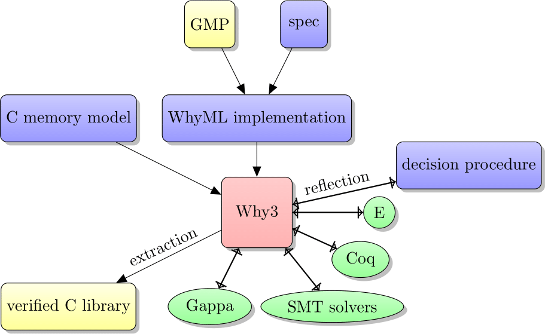

# WhyMP

WhyMP is an arbitrary-precision integer library for C that is inspired by [GMP](https://gmplib.org/), implemented in WhyML, and formally verified using [Why3](http://why3.lri.fr/).

The algorithms are heavily inspired from [the mpn layer](https://gmplib.org/manual/Low_002dlevel-Functions.html) of the GMP library. The implemented algorithms are addition, subtraction, multiplication (schoolbook and Toom-2), division, square root, and modular exponentiation. The library also provides some functions from [the mpz layer](https://gmplib.org/manual/Integer-Functions.html).

The list of supported functions can be found in the main header file [wmp.h](wmp.h).

The library is compatible with GMP, and its performance is comparable to its standalone version, mini-gmp. For numbers under about 1000 bits (100,000 for multiplication), it is about 10% slower than the generic, pure-C version of GMP, and about twice as slow as GMP with hand-coded assembly.

## Installing the library

To compile and install the library, use the following commands:

    ./autogen.sh
    make
    make install

## Using the library

The library is meant to be used in place of GMP. To do so, replace `#include <gmp.h>` by `#include <wmp.h>` in C source files, and replace `-lgmp` by `-lwmp` during linking. All functions and types are prefixed by `w` to avoid conflicts, e.g., `mpz_add` is called `wmpz_add`.

When unsupported functions are needed, one can instead use `#include <wmp-gmp.h>`. In that case, functions and types no longer need to be prefixed by `w`, as they also have their standard GMP names. All GMP functions are available, but the ones from WhyMP take precedence. Linking is then done using `-lwmp -lgmp`.

## Generating the sources

To regenerate the C sources of the library using Why3, go into the `why3` submodule, and then use the following commands:

    ./autogen.sh
    ./configure --enable-local && make
    cd examples/multiprecision
    make LOCAL=yes extract

This produces a directory `why3/examples/multiprecision/build`, which contains all the generated files from directory [lib](lib/).



## Project overview

We have specified and reimplemented GMP's algorithms in WhyML. To do so, we have developed a simple [memory model](https://gitlab.inria.fr/why3/why3/raw/master/stdlib/mach/c.mlw) of the C language in WhyML. This memory model allows us to write WhyML programs in a fragment of the language that is practically a shallow embedding of C.

We have added to Why3 an extraction mechanism from Why3 to C. It only supports WhyML programs that are in the C-like fragment of the language, but the compilation is transparent and does not add inefficiencies that the compiler cannot optimize away. Thus, the resulting C program is easily predictable to the WhyML programmer.

As an example, the WhyML implementation and extracted C version of the comparison function can be found below.

    let wmpn_cmp (x y: ptr uint64) (sz: int32): int32 =
      let ref i = sz in
      while i >= 1 do
        i <- i - 1;
        let lx = x[i] in
        let ly = y[i] in
        if lx <> ly then
        if lx > ly
        then return 1
        else return -1
      done;
      0

```c
int32_t wmpn_cmp(uint64_t * x, uint64_t * y, int32_t sz) {
  int32_t i;
  uint64_t lx, ly;
  i = sz;
  while (i >= 1) {
    i = i - 1;
    lx = x[i];
    ly = y[i];
    if (!(lx == ly)) {
      if (lx > ly) { return 1; }
      else { return -1; }
    }
  }
  return 0;
}
```
The WhyML proofs are about 20,000 lines long in total (for about 5000 lines of extracted C). The split is about 1/3 program code to 2/3 specifications and assertions.

## Licensing

The WhyMP Library is free software; you can redistribute it and/or modify it under the terms of the GNU Lesser General Public License as published by the Free Software Foundation; either version 3 of the License, or (at your option) any later version.
